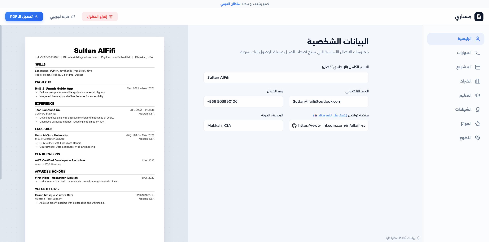
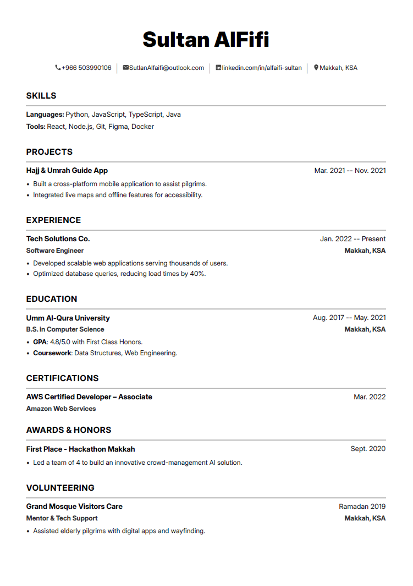

# Masari | مساري 🚀
## Professional CV Builder & PDF Architect

Masari (Arabic for "My Path") is a premium, privacy-first web application designed to help professionals build stunning, print-ready resumes directly in the browser. It features a modern Glassmorphism UI, a real-time responsive preview, and a robust PDF engine that produces high-quality vector documents.

### 🌐 [Live Demo: Start Building Now](https://AS-QARI.github.io/Masari-OREZ/)

[ARABIC_VERSION_LINK](#مساري--masari-)

---

### ✨ Features

- **💎 Premium Design**: Sleek Glassmorphism aesthetic with fluid animations.
- **🛡️ Privacy First**: All data is stored locally in your browser (`localStorage`). No servers, no tracking, complete security.
- **📱 True Mobile-First**: Fully responsive editor and preview, optimized for phones and tablets.
- **📄 Vector PDF Export**: Uses `pdfmake` for sharp, high-fidelity PDF generation with custom font embedding.
- **🖋️ Custom Typography**: Beautifully integrated with **Alexandria** (Arabic) and **Inter** (English) fonts.
- **💡 Smart Link System**: Automatically detects and formats social links (LinkedIn, GitHub, Twitter/X, etc.).

---

## 📸 Preview

### 🖥️ Editor Interface


### � Mobile View


### 📄 Generated PDF



### �🛠️ Technical Stack

- **Frontend**: Vanilla HTML5, CSS3 (Custom Design System), and JavaScript (ES6+).
- **Icons**: [Lucide Icons](https://lucide.dev/) & [FontAwesome](https://fontawesome.com/).
- **PDF Engine**: [pdfmake](http://pdfmake.org/) for powerful client-side PDF generation.
- **Fonts**: Embedded virtual file system (VFS) for consistent font rendering across all devices.

### 🚀 Quick Start

The fastest way to use Masari is via the live web application:
**👉 [https://AS-QARI.github.io/Masari-OREZ/](https://AS-QARI.github.io/Masari-OREZ/)**

#### Local Setup (Development)
If you prefer to run it locally or contribute:
1. Clone the repository:
   ```bash
   git clone https://github.com/AS-QARI/Masari-OREZ.git
   ```
2. Open `index.html` in any modern browser.

### ⚙️ Development & Customization

If you want to modify fonts or add new assets to the PDF virtual filesystem:
1. Place the new font files in the `fonts/` directory.
2. Run the build script:
   ```bash
   node tools/build-vfs.js
   ```
3. The new `vfs_fonts.js` will be generated automatically.

---

# مساري | Masari 🚀
## صانع السيرة الذاتية الاحترافي

**مساري** هو تطبيق ويب متطور مصمم لمساعدة المحترفين في بناء سير ذاتية مذهلة وجاهزة للطباعة مباشرة من المتصفح. يتميز بواجهة "Glassmorphism" عصرية، معينة حية متجاوبة، ومحرك PDF قوي ينتج مستندات عالية الجودة.

### 🌐 [رابط التجربة المباشرة: ابدأ الآن](https://AS-QARI.github.io/Masari-OREZ/)

### ✨ المميزات

- **💎 تصميم متميز**: جمالية Glassmorphism مع حركات انسيابية.
- **🛡️ الخصوصية أولاً**: تُحفظ جميع بياناتك محلياً في متصفحك (`localStorage`). لا توجد خوادم، لا يوجد تتبع، أمان كامل.
- **📱 متوافق مع الجوال**: محرر ومعاينة متجاوبة تماماً، ومحسنة للهواتف والأجهزة اللوحية.
- **📄 تصدير PDF عالي الجودة**: يستخدم `pdfmake` لتوليد ملفات PDF حادة وعالية الدقة مع تضمين الخطوط المخصصة.
- **🖋️ خطوط مخصصة**: متكامل تماماً مع خطي **Alexandria** (للعربي) و **Inter** (للإنجليزي).
- **💡 نظام روابط ذكي**: يكتشف وينسق روابط التواصل الاجتماعي تلقائياً (LinkedIn, GitHub, Twitter/X, إلخ).

---

## 📸 نظرة عامة (Preview)

### 🖥️ واجهة المحرر (Editor Interface)


### 📱 عرض الجوال (Mobile View)


### 📄 ملف الـ PDF الناتج (Generated PDF)


### 🛠️ التقنيات المستخدمة

- **الواجهة الأمامية**: HTML5، CSS3 (نظام تصميم خاص)، و JavaScript.
- **الأيقونات**: [Lucide Icons](https://lucide.dev/) و [FontAwesome](https://fontawesome.com/).
- **محرك الـ PDF**: [pdfmake](http://pdfmake.org/) لتوليد ملفات PDF قوية من جهة العميل.
- **الخطوط**: نظام ملفات افتراضي (VFS) مدمج لضمان ظهور الخطوط بشكل متناسق في جميع الأجهزة.

### 🚀 البدء في الاستخدام

أسرع طريقة لاستخدام مساري هي عبر الرابط المباشر:
**👉 [https://AS-QARI.github.io/Masari-OREZ/](https://AS-QARI.github.io/Masari-OREZ/)**

#### التشغيل المحلي (للمطورين)
إذا كنت ترغب بفتح المشروع على جهازك الخاص:
1. قم بتحميل المستودع:
   ```bash
   git clone https://github.com/AS-QARI/Masari-OREZ.git
   ```
2. افتح ملف `index.html` في أي متصفح حديث.

---

### 👨‍💻 Developed By
**Sultan AlFaifi | سلطان الفيفي**
[LinkedIn Profile](https://www.linkedin.com/in/alfaifi-sultan/)

---
*If you find this project helpful, please consider giving it a ⭐ on GitHub!*
